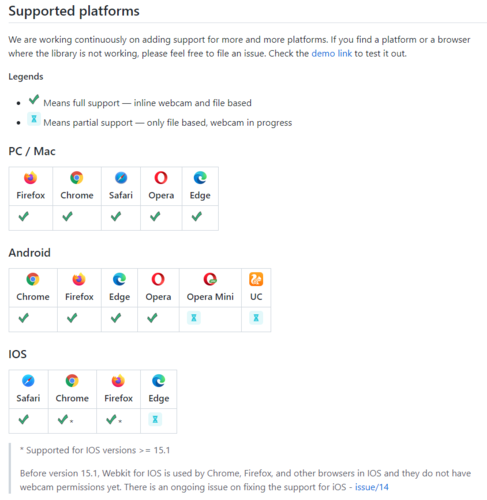
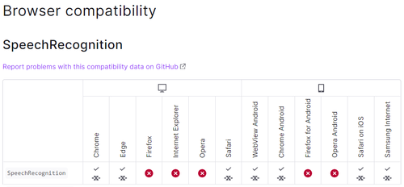

# ARSR - Anwendungs-Anleitung

## Inhalt

>### [Anwendung starten](#anwendungStarten)
>
>>#### [Start](#start)
>>
>>#### [Websiteberechtigungen](#websiteberechtigungen)
>>
>### [Anwendung verwenden](#anwendungVerwenden)
>
>>#### [SkillDisplay](#skillDisplay)
>>
>>#### [QR-Code Scan](#qrCodeScan)
>>
>>#### [SkillSet Fortschrittsanzeige](#skillSetFortschrittsanzeige)
>>
>>#### [Skill Anzeige](#skillAnzeige)
>>
>>#### [Sprachsteuerung](#sprachsteuerung)
>>
>### [Kompatibilität](#kompatibilitaet)
>>
>>#### [Detail](#detail)

---

## Anwendung starten

### Start

Die ARSR-Anwendung kann unter folgendem Link abgerufen,
gestartet und somit verwendet werden:
[https://arsr.skilldisplay.eu/anwendung/](https://arsr.skilldisplay.eu/anwendung/).

Vom ARSR-Team werden folgende **Browser je nach Endgerät** empfohlen:

- **PC / Mac:**
  - Google Chrome
  - Microsoft Edge
- **Android:**
  - Google Chrome
  - Microsoft Edge
- **IOS:**
  - aktuell leider keine Unterstützung (QR-Code Erkennung)

( Genauere Details finden Sie unter dem Punkt [Kompatibilität](#kompatibilitaet) )

### Websiteberechtigungen

Zur Verwendung der Spracherkennung muss zuerst der **Mikrofonzugriff**
erlaubt werden. Dieser wird direkt nach dem Starten der ARSR-Anwendung
abgefragt und sollte **zugelassen** werden.  
Andernfalls kann die ARSR-Anwendung mittels Standard Navigation per
Klick oder Berührung ebenso mit gleicher Funktionalität verwendet werden.

Zur Verwendung der Hauptfunktion muss der **Kamerazugriff** erlaubt werden.
Dieser wird nach dem Mikrofonzugriff abgefragt und muss
**zugelassen** werden.  
Andernfalls ist die ARSR-Anwendung nicht funktionstüchtig.

---

## Anwendung verwenden

### SkillDisplay

Zur **personalisierten** Verwendung der ARSR-Anwendung wird ein
[SkillDisplay-Konto](https://my.skilldisplay.eu/) vorausgesetzt.
Dieses wird dazu verwendet den Fortschritt des Users / der Userin
in der **SkillSet Fortschrittsanzeige** anzuzeigen. Dazu muss man im
verwendeten Browser bei SkillDisplay angemeldet sein.  
Weiters können dadurch **erlernte Skills** durch die vier Bestätigungsmöglichkeiten
("Self Assessment", "Educational Verification", "Practical Expertise"
und "Certification") **verifiziert** werden.

Zu **generellen** Verwendung der ARSR-Anwendung ohne der oben genannten
Zusatzfunktionen wird kein SkillDisplay-Konto zwingend benötigt.

### QR-Code Scan

Soll ein SkillSet geladen und angezeigt werden, muss ein QR-Code mithilfe der
ARSR-Anwendung gescannt werden. Dieser **QR-Code** muss entweder den
**direkten Link** (z.B.:
[https://my.skilldisplay.eu/skillset/332](https://my.skilldisplay.eu/skillset/332))
oder die **SkillSet-ID** (z.B.: "332") beinhalten.

### SkillSet Fortschrittsanzeige

Die SkillSet Fortschrittsanzeige besteht aus mehreren Bereichen. Diese werden
hier kurz beschrieben:

- **Titel**
  - Der Titel ist eine kurze und prägnante Information über den Inhalt und das
  Ziel des SkillSets.
- **Beschreibung**
  - Die Beschreibung gibt in detaillierter Form eine Übersicht über das SkillSet.
  Durch diese wird deutlich klar welchen Skill man durch einige "Skill-Pakete"
  erlernen wird.
- **Anzahl der Skills**
  - Die Anzahl der Skills dient zum ungefähren Einschätzen des Umfangs des SkillSets,
  ein genauer Zeitaufwand oder Vergleich kann dadurch nicht aufgestellt werden.
- **Fortschrittsanzeige**
  - Die Fortschrittsanzeige gibt bei der **personalisierten** Verwendung der ARSR-Anwendung
  die Prozentzahlen der verifizierten Skills in Relation zur Gesamtanzahl des
  SkillSets an.  
  Bei der **generellen** Verwendung der ARSR-Anwendung sind die Prozentzahlen immer bei 0%.
- **Navigationsleiste**
  - Die Navigationsleiste dient zur Navigation durch das SkillSet. Hierbei können zwei
  verschiedene Richtungen gewählt werden, vom ersten Skill zum letzten Skill und umgekehrt.

### Skill Anzeige

Zum Erlernen des SkillSets und dessen angepeilten Skills ist die Skill Anzeige
ein essenzieller Teil.  
Die Skill Anzeige besteht aus mehreren Bereichen. Diese werden hier kurz beschrieben:

- **Titel**
  - Der Titel ist eine kurze und prägnante Information über den Inhalt und das Ziel
  des Skills.
- **Beschreibung**
  - Die Beschreibung gibt in detaillierter Form eine Übersicht über den Skill.
- **Ziele**
  - Die Ziele der Skills stellen klar erkenntlich die Lernziele eines Skills dar.
  Diese dienen zur Überprüfung, ob der Skill als gelernt gilt.
- **Skill Verifizierung**
  - Die Skill Verifizierung bietet bei der **personalisierten** Verwendung der
  ARSR-Anwendung die Möglichkeit zur Verifizierung eines Skill durch vier
  Bestätigungsmöglichkeiten („Self Assessment“, „Educational Verification“,
  „Practical Expertise“ und „Certification“).  
  Bei der **generellen** Verwendung der ARSR-Anwendung wird die Anfrage zur Verifizierung fehlschlagen.
- **Navigationsleiste**
  - Die Navigationsleiste dient zur Navigation durch das SkillSet. Hierbei können zwei verschiedene
  Richtungen gewählt werden, vom ersten Skill zum letzten Skill und umgekehrt.

### Sprachsteuerung

Die Sprachsteuerung in der ARSR-Anwendung kann bei erlaubtem **Mikrofonzugriff** dauerhaft
verwendet werden. Sie bietet die Möglichkeit zur kontaktlosen Bedienung und Navigation in
der ARSR-Anwendung.  
Die folgenden Sprachkommandos, unter der Voraussetzung, dass ein SkillSet geladen und angezeigt ist,
können verwendet werden:
- **‚Next‘** oder **‚Following‘**
  - Mit diesen Befehlen kann in der Ansicht **weiter** navigiert werden.  
  > SkillSet Fortschrittsanzeige &#10132; Skill 1  
  Skill 3 &#10132; Skill 4  
  letzter Skill &#10132; SkillSet Fortschrittsanzeige
- **‚Back‘** oder **‚Previous‘**
  - Mit diesen Befehlen kann in der Ansicht **zurück** navigiert werden.  
  > SkillSet Fortschrittsanzeige &#10132; letzter Skill  
  Skill 3 &#10132; Skill 2  
  erster Skill &#10132; SkillSet Fortschrittsanzeige
- ‚Close‘
  - Mit diesem Befehl kann die SkillSet Fortschrittsanzeige oder die Skill Anzeige **geschlossen**
  werden.  
- ‚Verify‘ + Bestätigungsmöglichkeit 
  - Mit diesen Befehlen kann ein Skill in der gewünschten Form verifiziert werden.  
  > ‘Verify Self Assessment’  
  ‘Verify Educational Verification’  
  ‘Verify Practical Expertise’  
  ‘Verify Certification’

---

## Kompatibilität

### Detail

Die ARSR-Anwendung verwendet verschiedene erweiterte Funktionen, welche nur in **bestimmten Browsern
je nach Endgerät** funktionieren. Hier eine Detailansicht zu jeder verwendeten Technologie **zum
aktuellen Stand der Anleitung** (Änderungen je nach Updates möglich):
- QR-Code Erkennung

  
Abbildung 1:
[Html5-QRCode](https://github.com/mebjas/html5-qrcode)

 

- Sprachsteuerung (Kompatibilität)

  
Abbildung 2:
[Web Speech API - Web APIs | MDN (mozilla.org)](https://developer.mozilla.org/en-US/docs/Web/API/Web_Speech_API)

---